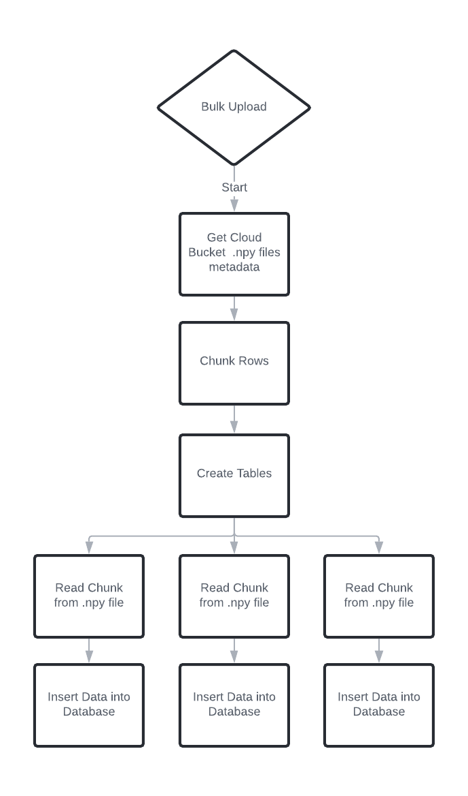
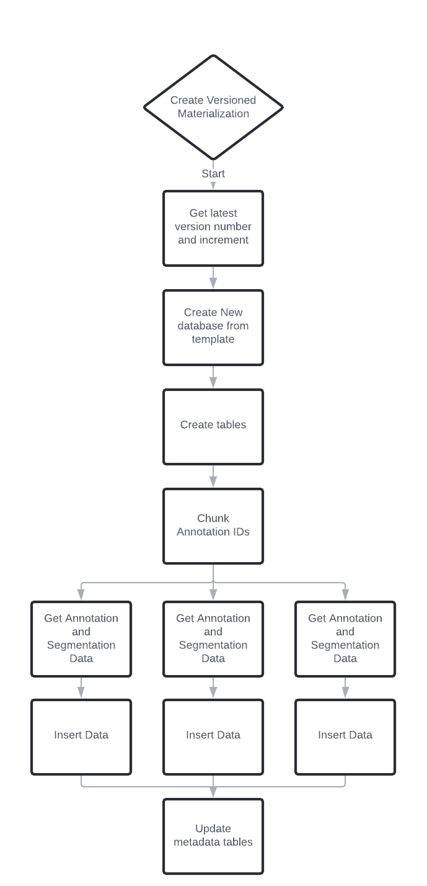
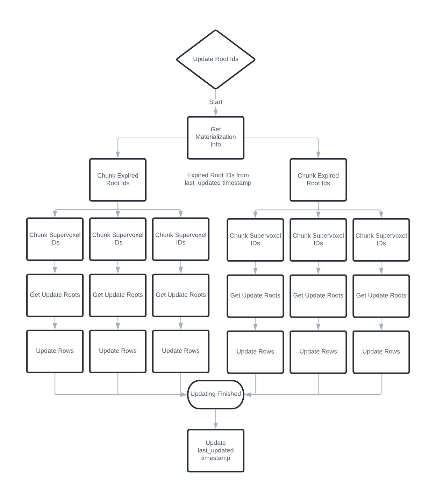
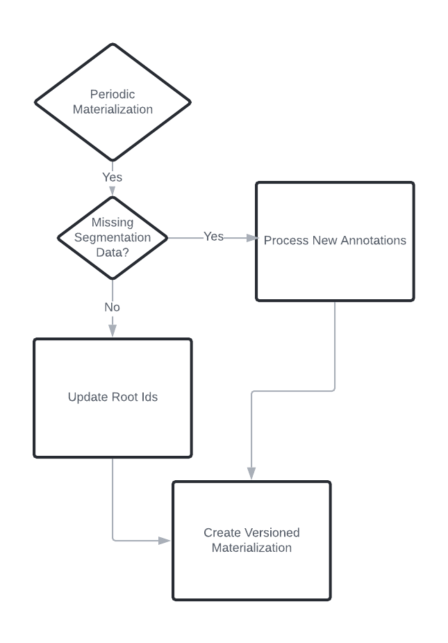

Materialization Engine Celery Task Workflows
============================================

The core of the materialization engine uses celery 
workflows to automate the process of keeping changing segmentation data
synced with underlying spatial annotations.

There are currently 5 workflows which each can be run independently.
In addition, the complete workflow combines the 'ingest new annotation',
'update root id' and 'materialize' workflow into one large workflow
for periodic materialization.

Please see the workflow diagrams below for a high level concept:

Bulk Upload Workflow
--------------------

The bulk upload workflow allows for inserting larger (10M+ row) datasets from 
a Google Cloud Bucket store into the PostgreSQL database. This is currently
done via a REST API endpoint.

Currently only .npy files are support. Each .npy file should represent a column or similar column
in the database.

For example if one has the following .npy files in a GCS Bucket:

-   id.npy
-   presyn_coords.npy
-   center_coords.npy
-   postsyn_coords.npy
-   sizes.npy
-   sv_ids_ordered.npy # contains pre and post supervoxel ids in two columns
-   root_ids_order.npy # contains pre and post root ids in two columns

The column mapping needs to match the schema used by the database. A dict is used to map
the named files to the corresponding schema defined columns. If there are multiple columns
in a given npy file it can be mapped as a list.

.. code-block:: python

   # map .npy files to database columns
   column_mapping = {
      "id": "id",
      "presyn_coords": "pre_pt_position",
      "center_coords": "ctr_pt_position",
      "postsyn_coords": "post_pt_position",
      "sizes": "size",
      "sv_ids_ordered": ["pre_pt_supervoxel_id", "post_pt_supervoxel_id"],
      "root_ids_ordered": ["pre_pt_root_id", "post_pt_root_id"],        
   }

Ingest New Annotations Workflow
-------------------------------

Since spatial annotations can be inserted into the database without corresponding
segmentation data (supervoxel ids and root ids) this workflow will look up the missing 
data and insert it into the database.

.. image:: ../images/new_annotations_workflow.png

Create Versioned Materialization Workflow
-----------------------------------------

The materialization workflow is the core of the materialization engine. The 'live' database 
is copied with an appended version number. The table annotation and linked segmentation tables
are merged together and re-indexed.

Update Root Ids Workflow
------------------------

This workflow finds expired root ids since the last time the database ran update root ids.
It will query for expired root ids and replace them by querying for the supervoxel ids 
and find the assigned root id.

Complete Workflow
-----------------

To automate the process of keeping the database up to date, the complete workflow combines
the 'Ingest New Annotations', 'Update Root Ids' and the 'Materialize' workflows into one.

Workflow Modules
----------------

materializationengine.blueprints.workflows.bulk\_upload module
--------------------------------------------------------------
Workflow for inserting large .npy files from a Google Cloud Storage
bucket into a PostgreSQL Database. 

.. automodule:: materializationengine.workflows.bulk_upload
   :members:
   :undoc-members:
   :show-inheritance:

materializationengine.blueprints.workflows.complete\_workflow module
--------------------------------------------------------------------
A workflow that ingests new annotations, finds expired root ids and
updates them and finally creates a time frozen copy of the database.

.. automodule:: materializationengine.workflows.complete_workflow
   :members:
   :undoc-members:
   :show-inheritance:

materializationengine.blueprints.workflows.create\_frozen\_database module
--------------------------------------------------------------------------
Creates a frozen copy of an annotation database where all segmentation data
is up to date until a given timestamp.

.. automodule:: materializationengine.workflows.create_frozen_database
   :members:
   :undoc-members:
   :show-inheritance:

materializationengine.blueprints.workflows.dummy\_workflow module
-----------------------------------------------------------------
Abstract test workflow.

.. automodule:: materializationengine.workflows.dummy_workflow
   :members:
   :undoc-members:
   :show-inheritance:

materializationengine.blueprints.workflows.ingest\_new\_annotations module
--------------------------------------------------------------------------
Finds missing segmentation data where an annotation exists. The 
supervoxel id is acquired from the spatial position and is used to 
find the corresponding root id for a given timestamp.

.. automodule:: materializationengine.workflows.ingest_new_annotations
   :members:
   :undoc-members:
   :show-inheritance:

materializationengine.blueprints.workflows.periodic\_database\_removal module
-----------------------------------------------------------------------------
Removes (Drops) databases if the current time is past the expired timestamp.

.. automodule:: materializationengine.workflows.periodic_database_removal
   :members:
   :undoc-members:
   :show-inheritance:

materializationengine.blueprints.workflows.periodic\_materialization module
---------------------------------------------------------------------------
Creates materialized databases on a fixed schedule.

.. automodule:: materializationengine.workflows.periodic_materialization
   :members:
   :undoc-members:
   :show-inheritance:

materializationengine.blueprints.workflows.update\_root\_ids module
-------------------------------------------------------------------
Finds expired root ids since last lookup, queries for the new root id
and inserts them into the database

.. automodule:: materializationengine.workflows.update_root_ids
   :members:
   :undoc-members:
   :show-inheritance:

Module contents
---------------

.. automodule:: materializationengine.workflows
   :members:
   :undoc-members:
   :show-inheritance:
